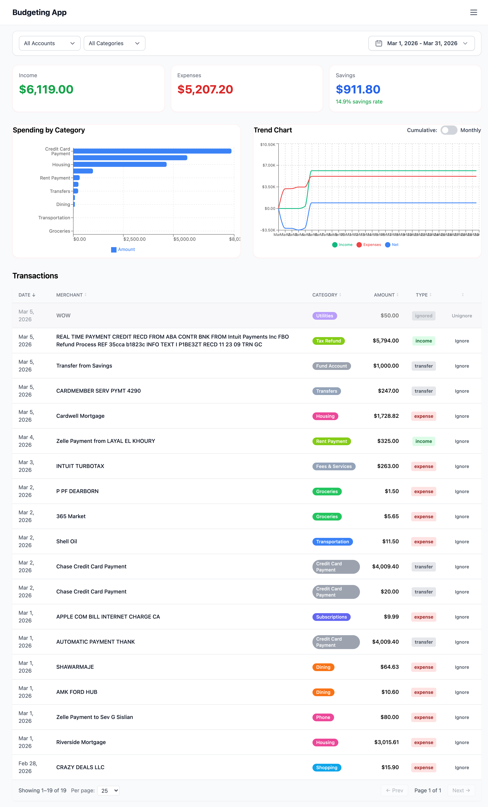
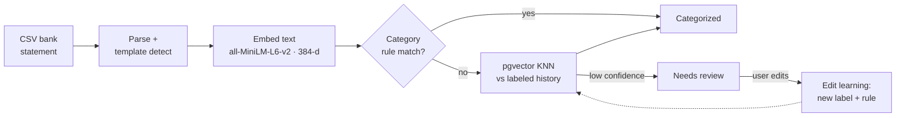

# Budgeting App

A personal-finance app that **auto-categorizes bank transactions with vector embeddings + KNN**, then visualizes income, spending, and savings trends. Runs fully locally — embeddings are computed in-process, with no cloud API.






## Features

- **CSV Import** - Upload bank statements and automatically parse transactions
- **AI Categorization** - Auto-categorize transactions using vector embeddings and KNN
- **Smart Rules** - Create rules to automatically categorize future transactions
- **Trends & Insights** - Visualize income, expenses, and savings over time
- **Category Management** - Custom categories with colors and icons
- **Multi-Account Support** - Track checking, savings, and credit card accounts
- **Import History** - Track and manage all CSV imports

## Tech Stack

### Frontend
- **React 18** with TypeScript
- **Vite** - Fast build tool and dev server
- **Tailwind CSS** - Utility-first styling
- **Recharts** - Chart library for data visualization
- **Vitest** - Unit testing

### Backend
- **Express** - Web server framework
- **PostgreSQL** - Primary database
- **pgvector** - Vector similarity search extension
- **@huggingface/transformers** - In-process text embeddings (all-MiniLM-L6-v2, 384-d) — no external API needed; a remote vLLM endpoint is also supported

### DevOps
- **Docker** - Containerization
- **GitHub Actions** - CI/CD pipeline

## Engineering highlights

The interesting problems, and where to read the code:

- **Embedding-based auto-categorization.** Each transaction's text is embedded (all-MiniLM-L6-v2, 384-d) and categorized by **k-nearest-neighbors over your own labeled history** via pgvector cosine similarity — so it learns *your* categories, not a fixed taxonomy. (`backend/src/services/{embeddings,knn,categorize}.ts`)
- **A rules fast-path before the vector search.** Deterministic `category_rules` (exact / contains / regex) handle obvious cases cheaply; KNN runs only on what's left; anything low-confidence is flagged `needs_review`. (`backend/src/services/categorize.ts`)
- **An edit-learning loop.** Recategorizing a transaction writes a trusted label (and optionally a reusable rule) that immediately improves future KNN results — no re-embedding, no retraining. (`backend/src/routes/imports.ts`)
- **Runs fully locally.** Embeddings compute in-process via `@huggingface/transformers` (the model auto-downloads on first run) against PostgreSQL + pgvector; also packaged as an offline **Electron** desktop app. (`backend/src/services/localEmbeddings.ts`)
- **Bank-template auto-detection.** CSV import sniffs each bank's column layout instead of requiring a fixed format. (`frontend/src/features/import/csvParser.ts`)
- **Typed end to end.** TypeScript strict mode across a React 18 + Vite frontend and an Express backend; money is stored as integer cents (`BIGINT`) to avoid float drift.

## Quick Start

### Prerequisites

- Node.js 20+
- PostgreSQL 16+ with pgvector extension
- Docker (optional)

### Local Development

1. **Clone the repository**
   ```bash
   git clone https://github.com/hterzia/budgeting-app.git
   cd budgeting-app
   ```

2. **Set up the database**

   ```bash
   cd backend
   cp .env.example .env.local
   # Edit .env.local with your PostgreSQL credentials
   npm run migration:up
   ```

3. **Start the development servers**
   ```bash
   # Terminal 1 - Backend
   cd backend
   npm run dev

   # Terminal 2 - Frontend
   cd frontend
   npm run dev
   ```

   The frontend will be available at `http://localhost:3000` and the backend at `http://localhost:3001`.

### Running Tests

```bash
# Run all tests
npm run test

# Run with coverage
npm run test:coverage

# Type checking
npm run type-check
```

### Using Docker

```bash
# Start with Docker Compose
cp backend/.env.example backend/.env.local
docker-compose up --build

# Or run manually
docker build -t budgeting-app .
docker run -p 3001:3001 --env-file backend/.env.local budgeting-app
```

## Project Structure

```
budgeting-app/
├── frontend/               # React application
│   ├── src/
│   │   ├── features/      # Feature modules
│   │   │   ├── dashboard/ # Dashboard pages
│   │   │   ├── insights/  # Insights and widgets
│   │   │   ├── import/    # CSV import functionality
│   │   │   └── transactions/ # Transaction utilities
│   │   ├── shared/        # Shared UI components
│   │   └── app/           # App router and providers
│   └── vite.config.ts
├── backend/               # Express API
│   ├── src/
│   │   ├── routes/       # API endpoints
│   │   ├── services/     # Business logic
│   │   │   ├── categorize.ts    # Rule + KNN categorization
│   │   │   ├── embeddings.ts    # Vector embedding generation
│   │   │   └── knn.ts           # K-Nearest Neighbors queries
│   │   ├── db/           # Database config and queries
│   │   └── utils/        # Utilities
│   └── migrations/       # Database migrations
└── docs/
```

## API Documentation

See the [API Documentation](docs/api/README.md) for complete endpoint reference.

### Key Endpoints

| Method | Endpoint | Description |
|--------|----------|-------------|
| GET | `/health` | Health check |
| POST | `/imports` | Upload CSV file |
| GET | `/imports/:id` | Get import status |
| POST | `/imports/:id/process` | Trigger categorization |
| GET | `/imports/:id/review-queue` | Get uncategorized transactions |
| POST | `/transactions/:id/category` | Update transaction category |
| GET | `/transactions` | List all transactions |
| GET | `/accounts` | List accounts |
| GET | `/categories` | List categories |

## Contributing

Contributions are welcome! Please read [CONTRIBUTING.md](CONTRIBUTING.md) for details on our code of conduct and the process for submitting pull requests.

## License

This project is licensed under the MIT License - see the [LICENSE](LICENSE) file for details.

## Acknowledgments

- Uses [vLLM](https://vllm.readthedocs.io/) for efficient LLM inference
- Embedding model: [Xenova/all-MiniLM-L6-v2](https://huggingface.co/Xenova/all-MiniLM-L6-v2) via [transformers.js](https://github.com/huggingface/transformers.js)
- Vector search: [pgvector](https://github.com/pgvector/pgvector)

## Support

- Open an issue on GitHub
- Check the [wiki](docs/) for detailed documentation
