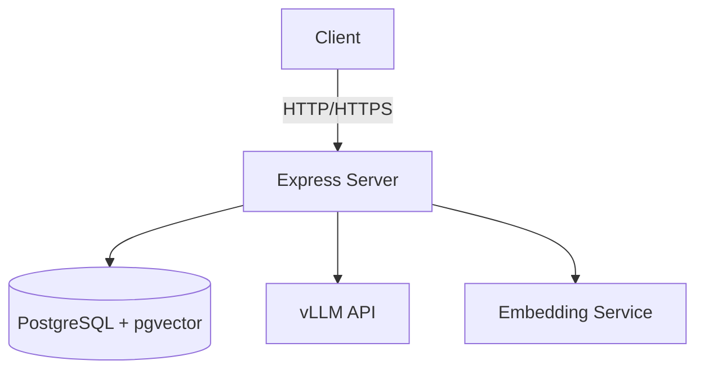

# Production-Ready Refactor Plan

> **For Claude:** This is a comprehensive plan for making the budgeting app open-source ready. Use `superpowers:executing-plans` to implement this task-by-task.

**Goal:** Transform this budgeting app from a personal project into a production-ready, open-source codebase that is maintainable, well-documented, secure, and follows best practices.

**Architecture:** Full-stack React/Vite frontend with TypeScript and Express/PostgreSQL backend with pgvector for AI-powered transaction categorization.

**Tech Stack:**
- Frontend: React 18, Vite, TypeScript, Tailwind CSS, Recharts, Vitest
- Backend: Express, PostgreSQL with pgvector, Node.js 20+
- AI: vLLM for embeddings (Llama-Embed-Nemotron-8b), LLM categorization

---

## Phase 0: Project Infrastructure & Documentation

### Task 0.1: Repository Organization & README

**Files:**
- Create: `README.md`
- Modify: `LICENSE` (add Apache 2.0 or MIT)

**Step 1: Create comprehensive README**

Create a `README.md` with:
- Project title and description
- Features (CSV import, auto-categorization, insights, trends)
- Tech stack (frontend, backend, database, AI)
- Quick start guide (development setup)
- Production deployment guide
- Contributing guidelines
- Code of conduct
- License information

**Step 2: Add LICENSE file**

```bash
# Check if LICENSE exists
ls -la LICENSE* 2>/dev/null || echo "No license found"
```

If no license exists, create one (MIT recommended for open source):

```markdown
# MIT License

Copyright (c) 2026 [Your Name]

Permission is hereby granted...
```

---

### Task 0.2: Add Project Configuration Files

**Files:**
- Create: `.editorconfig`
- Create: `CONTRIBUTING.md`
- Create: `CODE_OF_CONDUCT.md`

**Step 1: Create .editorconfig**

```ini
# .editorconfig
root = true

[*]
indent_style = space
indent_size = 2
end_of_line = lf
charset = utf-8
trim_trailing_whitespace = true
insert_final_newline = true

[*.md]
trim_trailing_whitespace = false

[*.sql]
indent_size = 2
```

**Step 2: Create CONTRIBUTING.md**

Document:
- How to set up development environment
- Code style guidelines
- Commit message conventions
- Pull request process
- Testing expectations

**Step 3: Create CODE_OF_CONDUCT.md**

Use the default Contributor Covenant template.

---

## Phase 1: Backend Security & Hardening

### Task 1.1: Environment Variable Security

**Files:**
- Modify: `backend/.env.example`
- Modify: `backend/src/db/config.ts`

**Step 1: Update .env.example with placeholder values**

```bash
# Current .env.local has real credentials - these must NOT be committed
# .env.example should have sensible defaults without real credentials
```

**Step 2: Add validation in config.ts**

```typescript
export function getDatabaseConfig(): DatabaseConfig {
  const config = {
    host: process.env.POSTGRES_HOST,
    port: parseInt(process.env.POSTGRES_PORT || '5432', 10),
    database: process.env.POSTGRES_DB,
    user: process.env.POSTGRES_USER,
    password: process.env.POSTGRES_PASSWORD,
  };

  // Validate required environment variables
  const required = ['POSTGRES_HOST', 'POSTGRES_DB', 'POSTGRES_USER', 'POSTGRES_PASSWORD'];
  const missing = required.filter(key => !process.env[key]);

  if (missing.length > 0) {
    throw new Error(`Missing required environment variables: ${missing.join(', ')}`);
  }

  // Validate port is a valid number
  if (isNaN(config.port) || config.port < 1 || config.port > 65535) {
    throw new Error('Invalid POSTGRES_PORT');
  }

  return config;
}
```

**Step 3: Add .env.local to .gitignore verification**

Ensure `.env.local` and all `.env.*` files are in `.gitignore`.

---

### Task 1.2: SQL Injection Prevention Audit

**Files:**
- Review: `backend/src/db/queries.ts`
- Review: `backend/src/routes/imports.ts`
- Review: `backend/src/routes/data.ts`

**Step 1: Audit all raw queries for proper parameterization**

All queries should use `$1`, `$2`, etc. placeholders. Check for:
- String concatenation in SQL queries
- Template literals with unescaped variables
- Direct interpolation of user input

**Step 2: Add query logging for debugging (in development only)**

```typescript
// Add to db/config.ts
export function createPool(): Pool {
  const config = getDatabaseConfig();
  const pool = new Pool({ ...config });

  // Add query logging in development
  if (process.env.NODE_ENV === 'development') {
    pool.on('query', (e) => {
      console.log('[db] query:', e.query);
      console.log('[db] params:', e.params);
    });
    pool.on('error', (e) => {
      console.error('[db] error:', e);
    });
  }

  return pool;
}
```

**Step 3: Verify all SQL uses parameterized queries**

Check these files specifically:
- `queries.ts` - All functions appear to use parameterized queries ✓
- `imports.ts` - Verify all queries use `$1`, `$2` format
- `data.ts` - Verify all queries use `$1`, `$2` format

---

### Task 1.3: Error Handling & Logging

**Files:**
- Modify: `backend/src/server.ts`
- Create: `backend/src/utils/logging.ts`

**Step 1: Create centralized logging utility**

```typescript
// backend/src/utils/logging.ts
import pino from 'pino';

const isProduction = process.env.NODE_ENV === 'production';

export const logger = pino({
  level: process.env.LOG_LEVEL || 'info',
  transport: isProduction ? undefined : {
    target: 'pino-pretty',
    options: { colorize: true },
  },
  base: {
    pid: false,
    hostname: false,
  },
  timestamp: () => `,"time":"${new Date().toISOString()}"`,
});

export function handleDatabaseError(error: any): never {
  if (error.code === '23505') {
    throw new Error('Record already exists');
  }
  if (error.code === '23503') {
    throw new Error('Foreign key constraint violation');
  }
  throw error;
}
```

**Step 2: Update server.ts to use logger**

```typescript
import { logger } from './utils/logging.js';

app.listen(PORT, BIND_HOST, () => {
  logger.info(`Server listening on ${BIND_HOST}:${PORT}`);
  logger.info(`Environment: ${process.env.NODE_ENV || 'development'}`);
});
```

**Step 3: Add error boundary middleware**

```typescript
// Add after middleware setup, before routes
app.use((err: Error, req: Request, res: Response, next: NextFunction) => {
  logger.error('Unhandled error:', {
    message: err.message,
    stack: err.stack,
    path: req.path,
  });

  res.status(500).json({ error: 'Internal server error' });
});
```

---

### Task 1.4: API Security Headers

**Files:**
- Modify: `backend/src/server.ts`

**Step 1: Add security headers middleware**

```typescript
import helmet from 'helmet';

app.use(helmet({
  contentSecurityPolicy: {
    directives: {
      defaultSrc: ["'self'"],
      scriptSrc: ["'self'"],
      styleSrc: ["'self'", "'unsafe-inline'"], // Tailwind needs unsafe-inline
      imgSrc: ["'self'", 'data:', 'https:'],
      connectSrc: ["'self'"],
      fontSrc: ["'self'"],
      objectSrc: ["'none'"],
      mediaSrc: ["'self'"],
      frameSrc: ["'none'"],
    },
  },
}));

// Additional security headers
app.use((req, res, next) => {
  res.setHeader('X-Content-Type-Options', 'nosniff');
  res.setHeader('X-Frame-Options', 'DENY');
  res.setHeader('X-XSS-Protection', '1; mode=block');
  res.setHeader('Referrer-Policy', 'strict-origin-when-cross-origin');
  next();
});
```

**Step 2: Install helmet dependency**

```bash
cd backend
npm install helmet
```

---

## Phase 2: Database Improvements

### Task 2.1: Connection Pooling & Migrations

**Files:**
- Modify: `backend/src/db/config.ts`
- Review: `backend/migrations/`

**Step 1: Add connection pool health checks**

```typescript
export async function testDatabaseConnection(pool: Pool): Promise<boolean> {
  try {
    await pool.query('SELECT 1');
    return true;
  } catch {
    return false;
  }
}
```

**Step 2: Add migration status endpoint**

Create a new route to track migration status for deployment verification.

**Step 3: Review all migration files**

- Check for proper `BEGIN`/`COMMIT` blocks
- Verify all migrations are idempotent or properly guarded
- Ensure rollback files are complete and tested

---

### Task 2.2: Add Database Indexes for Performance

**Files:**
- Create: `backend/migrations/0021_add_performance_indexes.sql`
- Create: `backend/migrations/0021_add_performance_indexes_rollback.sql`

**Step 1: Create performance index migration**

```sql
-- Performance indexes for common query patterns

-- Transactions by user and date range
CREATE INDEX CONCURRENTLY IF NOT EXISTS idx_transactions_user_date
ON transactions (user_id, posted_at DESC);

-- Transactions by category
CREATE INDEX CONCURRENTLY IF NOT EXISTS idx_transactions_category
ON transactions (user_id, category_id);

-- Transactions by import batch
CREATE INDEX CONCURRENTLY IF NOT EXISTS idx_transactions_import_batch
ON transactions (import_batch_id);

-- Embeddings by user
CREATE INDEX CONCURRENTLY IF NOT EXISTS idx_embeddings_user
ON transaction_embeddings (user_id);

-- Category rules by user
CREATE INDEX CONCURRENTLY IF NOT EXISTS idx_category_rules_user
ON category_rules (user_id, enabled);

-- Import batches by user
CREATE INDEX CONCURRENTLY IF NOT EXISTS idx_import_batches_user
ON import_batches (user_id, created_at DESC);

-- Merchant normalization by user
CREATE INDEX CONCURRENTLY IF NOT EXISTS idx_merchant_normalization_user
ON merchant_normalization_replacements (user_id, enabled);
```

---

### Task 2.3: Add Database Constraints

**Files:**
- Review: `backend/migrations/0001_init.sql`
- Create: `backend/migrations/0022_add_data_constraints.sql`

**Step 1: Add constraints migration**

```sql
-- Add data integrity constraints

-- Ensure amounts are reasonable (prevent accidental billion dollar transactions)
ALTER TABLE transactions
ADD CONSTRAINT chk_amount_cents_reasonable
CHECK (amount_cents >= -100000000 AND amount_cents <= 100000000);

-- Ensure category confidence is between 0 and 1
ALTER TABLE transactions
ADD CONSTRAINT chk_category_confidence_range
CHECK (category_confidence IS NULL OR (category_confidence >= 0 AND category_confidence <= 1));

-- Ensure currency is valid (ISO 4217)
ALTER TABLE transactions
ADD CONSTRAINT chk_currency_valid
CHECK (currency IS NULL OR currency ~ '^[A-Z]{3}$');

-- Ensure type values are valid
ALTER TABLE transactions
ADD CONSTRAINT chk_transaction_type
CHECK (type IN ('income', 'expense', 'transfer', 'refund', 'ignored'));
```

---

## Phase 3: Code Quality & Testing

### Task 3.1: TypeScript Configuration

**Files:**
- Modify: `backend/tsconfig.json`
- Modify: `frontend/tsconfig.json`

**Step 1: Ensure strict TypeScript settings**

```json
{
  "compilerOptions": {
    "target": "ES2020",
    "module": "NodeNext",
    "moduleResolution": "NodeNext",
    "strict": true,
    "esModuleInterop": true,
    "skipLibCheck": true,
    "forceConsistentCasingInFileNames": true,
    "resolveJsonModule": true,
    "declaration": true,
    "declarationMap": true,
    "sourceMap": true,
    "outDir": "./dist",
    "rootDir": "./src"
  }
}
```

**Step 2: Add linting configuration**

Create `backend/eslint.config.mjs`:

```javascript
import js from '@eslint/js';
import typescript from '@typescript-eslint/eslint-plugin';
import typescriptParser from '@typescript-eslint/parser';

export default [
  js.configs.recommended,
  {
    files: ['**/*.ts', '**/*.tsx'],
    languageOptions: {
      parser: typescriptParser,
      parserOptions: {
        ecmaVersion: 2020,
        sourceType: 'module',
        project: './tsconfig.json',
      },
    },
    plugins: {
      '@typescript-eslint': typescript,
    },
    rules: {
      '@typescript-eslint/explicit-function-return-type': 'warn',
      '@typescript-eslint/no-unused-vars': ['error', { argsIgnorePattern: '^_' }],
      '@typescript-eslint/no-explicit-any': 'error',
      'no-console': 'error',
    },
  },
];
```

---

### Task 3.2: Test Coverage Improvements

**Files:**
- Review: `backend/tests/`
- Review: `frontend/src/**/*.test.ts*`

**Step 1: Add integration tests for API endpoints**

```typescript
// backend/tests/api/imports.test.ts
import request from 'supertest';
import app from '../../src/server.js';
import { createPool } from '../../src/db/config.js';

describe('POST /imports', () => {
  it('should reject upload without file', async () => {
    const response = await request(app)
      .post('/imports')
      .send({ userId: 'test' });
    expect(response.status).toBe(400);
  });

  it('should validate userId format', async () => {
    const response = await request(app)
      .post('/imports')
      .send({ file: '', userId: 'invalid-uuid' });
    expect(response.status).toBe(400);
  });
});
```

**Step 2: Add e2e tests for critical user flows**

```typescript
// playwright tests for:
// - CSV upload and import
// - Transaction categorization
// - Category management
// - Date range filtering
```

**Step 3: Set up coverage reporting**

```bash
npm run test -- --coverage
```

Add to `package.json`:

```json
{
  "scripts": {
    "test:coverage": "npm run test -- --coverage"
  }
}
```

---

### Task 3.3: Code Quality Tools

**Files:**
- Create: `.prettierrc`
- Create: `.nvmrc`

**Step 1: Create Prettier config**

```json
{
  "semi": true,
  "singleQuote": true,
  "tabWidth": 2,
  "trailingComma": "es5",
  "printWidth": 100,
  "arrowParens": "avoid",
  "bracketSpacing": true
}
```

**Step 2: Add npm scripts for formatting and linting**

```json
{
  "scripts": {
    "lint": "eslint . --ext ts,tsx",
    "lint:fix": "eslint . --ext ts,tsx --fix",
    "format": "prettier --write .",
    "format:check": "prettier --check ."
  }
}
```

---

## Phase 4: Frontend Improvements

### Task 4.1: Component Architecture

**Files:**
- Review: `frontend/src/features/`
- Review: `frontend/src/shared/`

**Step 1: Organize components by domain**

```
src/
├── features/
│   ├── dashboard/
│   │   ├── components/
│   │   │   ├── Trends/
│   │   │   ├── SpendingSummary/
│   │   │   ├── SpendingByCategory/
│   │   │   └── TransactionList/
│   │   └── DashboardPage.tsx
```

**Step 2: Create reusable UI primitives**

Move shared components to `shared/ui/`:
- `Button`
- `Card`
- `Badge`
- `Table`
- `Modal`
- `EmptyState`
- `Spinner`

**Step 3: Add prop types and documentation**

```typescript
// Add JSDoc comments to all components
/**
 * Renders a transaction list table with filtering and sorting.
 *
 * @example
 * <TransactionList
 *   transactions={transactions}
 *   onCategoryChange={handleCategoryChange}
 * />
 */
export function TransactionList({ transactions, onCategoryChange }: Props) {
```

---

### Task 4.2: State Management Patterns

**Files:**
- Review: `frontend/src/app/providers/BudgetProvider.tsx`
- Review: `frontend/src/app/providers/DashboardProvider.tsx`

**Step 1: Add error boundary to providers**

```typescript
import { ErrorBoundary } from 'react-error-boundary';

function ErrorFallback({ error }: { error: Error }) {
  return <div>Error: {error.message}</div>;
}

export function BudgetProvider({ children }: { children: ReactNode }) {
  return (
    <ErrorBoundary FallbackComponent={ErrorFallback}>
      <BudgetContextProvider>{children}</BudgetContextProvider>
    </ErrorBoundary>
  );
}
```

**Step 2: Add loading states**

Ensure all data fetching shows appropriate loading indicators.

---

### Task 4.3: Accessibility (a11y)

**Files:**
- Review: All React components

**Step 1: Add ARIA labels**

Ensure all interactive elements have proper labels.

**Step 2: Keyboard navigation**

Verify all components support keyboard navigation.

**Step 3: Color contrast**

Run axe-devtools or similar to check contrast ratios.

---

## Phase 5: Performance Optimization

### Task 5.1: Frontend Performance

**Files:**
- Review: `frontend/src/features/`
- Create: `frontend/src/utils/memoize.ts`

**Step 1: Add React.memo for expensive components**

```typescript
export const SpendingByCategory = React.memo(function SpendingByCategory({ transactions, ...props }) {
  // Component implementation
});
```

**Step 2: Implement virtual scrolling for large lists**

Consider `react-window` or `@tanstack/react-virtual` for transaction lists.

**Step 3: Optimize bundle size**

```bash
npm run build
# Analyze with: vite-bundle-visualizer
```

---

### Task 5.2: Backend Performance

**Files:**
- Review: `backend/src/services/embeddings.ts`
- Review: `backend/src/services/knn.ts`

**Step 1: Add caching layer**

Consider Redis for:
- Embedding model configuration
- Category lists
- Transaction classification keywords

**Step 2: Optimize KNN queries**

- Add pgvector index: `CREATE INDEX idx_embeddings_vector ON transaction_embeddings USING ivfflat (embedding vector_cosine_ops);`

**Step 3: Add request batching**

Batch multiple API requests to reduce round trips.

---

## Phase 6: Documentation

### Task 6.1: API Documentation

**Files:**
- Create: `docs/api/`

**Step 1: Create OpenAPI/Swagger spec**

```yaml
# docs/api/openapi.yaml
openapi: 3.0.0
info:
  title: Budgeting App API
  version: 1.0.0
paths:
  /health:
    get:
      summary: Health check
      responses:
        '200':
          description: Server is healthy
```

**Step 2: Document all endpoints**

Include:
- Request/response schemas
- Authentication requirements
- Rate limits
- Error responses

---

### Task 6.2: Architecture Documentation

**Files:**
- Create: `docs/architecture/`

**Step 1: Create system diagram**



**Step 2: Document data flow**

- CSV Import Flow
- Categorization Pipeline
- Edit Learning Flow

---

### Task 6.3: Developer Guide

**Files:**
- Create: `docs/developer-guide.md`

**Step 1: Setup instructions**

- Prerequisites (Node.js, PostgreSQL, vLLM)
- Environment setup
- Database setup
- Running tests

**Step 2: Code patterns**

- Component patterns
- State management patterns
- API patterns

---

## Phase 7: Deployment

### Task 7.1: Docker Configuration

**Files:**
- Create: `Dockerfile`
- Create: `docker-compose.yml`

**Step 1: Create backend Dockerfile**

```dockerfile
FROM node:20-alpine AS builder

WORKDIR /app

# Copy package files
COPY package*.json ./
COPY backend/package*.json ./backend/

# Install dependencies
RUN npm ci --only=production

# Copy source
COPY backend ./backend
COPY frontend ./frontend

# Build frontend
RUN cd frontend && npm ci && npm run build

# Production image
FROM node:20-alpine

WORKDIR /app

RUN addgroup -g 1001 -S nodejs
RUN adduser -S nextjs -u 1001

COPY --from=builder /app/backend/dist ./backend/dist
COPY --from=builder /app/frontend/dist ./frontend/dist
COPY --from=builder /app/backend/package*.json ./
COPY --from=builder /app/backend/node_modules ./backend/node_modules

USER nodejs

EXPOSE 3001

CMD ["node", "backend/dist/server.js"]
```

**Step 2: Create docker-compose.yml**

```yaml
version: '3.8'
services:
  app:
    build: .
    ports:
      - "3001:3001"
    environment:
      - POSTGRES_HOST=postgres
      - POSTGRES_PORT=5432
      - POSTGRES_DB=budgeting
      - POSTGRES_USER=budgeting
      - POSTGRES_PASSWORD=${POSTGRES_PASSWORD}
    depends_on:
      - postgres

  postgres:
    image: pgvector/pgvector:pg16
    ports:
      - "5432:5432"
    environment:
      - POSTGRES_DB=budgeting
      - POSTGRES_USER=budgeting
      - POSTGRES_PASSWORD=${POSTGRES_PASSWORD}
    volumes:
      - postgres_data:/var/lib/postgresql/data
      - ./backend/migrations:/docker-entrypoint-initdb.d

volumes:
  postgres_data:
```

---

### Task 7.2: CI/CD Pipeline

**Files:**
- Create: `.github/workflows/ci.yml`

**Step 1: Create CI workflow**

```yaml
name: CI

on:
  push:
    branches: [main]
  pull_request:
    branches: [main]

jobs:
  test:
    runs-on: ubuntu-latest
    services:
      postgres:
        image: pgvector/pgvector:pg16
        env:
          POSTGRES_DB: budgeting_test
          POSTGRES_USER: budgeting
          POSTGRES_PASSWORD: budgeting
        ports:
          - 5432:5432
        options: >-
          --health-cmd pg_isready
          --health-interval 10s
          --health-timeout 5s
          --health-retries 5

    steps:
      - uses: actions/checkout@v4

      - name: Setup Node.js
        uses: actions/setup-node@v4
        with:
          node-version: '20'

      - name: Install dependencies
        run: npm ci

      - name: Run lint
        run: npm run lint

      - name: Run type check
        run: npm run type-check

      - name: Run tests
        run: npm run test
```

---

## Phase 8: Monitoring & Observability

### Task 8.1: Application Monitoring

**Files:**
- Create: `backend/src/middleware/metrics.ts`

**Step 1: Add metrics middleware**

```typescript
import { prometheusmetrics } from 'some-metrics-lib';

// Track request duration, count, and errors
app.use(metricsMiddleware({
  endpoints: ['/imports', '/transactions', '/accounts', '/categories'],
}));
```

**Step 2: Add health check endpoint**

```typescript
app.get('/health', (req, res) => {
  const dbHealthy = await testDatabaseConnection(pool);
  res.json({
    status: dbHealthy ? 'ok' : 'degraded',
    timestamp: new Date().toISOString(),
    checks: {
      database: dbHealthy ? 'healthy' : 'unhealthy',
    },
  });
});
```

---

### Task 8.2: Error Tracking

**Files:**
- Create: `backend/src/utils/sentry.ts` (optional)

**Step 1: Add error tracking (Sentry/Rollbar)**

Configure for production to track errors in real-time.

---

## Phase 9: Cleanup & Refactoring

### Task 9.1: Remove Debug Code

**Files:**
- Review: All source files

**Step 1: Remove console.log statements**

Keep only essential logging (use logger instead).

**Step 2: Remove commented code**

Clean up commented-out code blocks.

**Step 3: Remove TODO comments**

 either implement or delete.

---

### Task 9.2: Fix Inconsistencies

**Files:**
- Review: Type definitions

**Step 1: Sync frontend and backend types**

Ensure `Transaction`, `Category`, `Account` types match.

**Step 2: Standardize naming conventions**

- `userId` vs `user_id` - be consistent
- `categoryId` vs `category_id` - be consistent

**Step 3: Normalize date formats**

All dates should be ISO 8601 strings.

---

### Task 9.3: Documentation Cleanup

**Files:**
- Review: All comments

**Step 1: Update outdated comments**

**Step 2: Remove dead code comments**

**Step 3: Add inline documentation**

---

## Phase 10: Final Verification

### Task 10.1: Security Audit

**Files:**
- Run: `npm audit`
- Run: `snyk test`

**Step 1: Fix security vulnerabilities**

```bash
npm audit fix
```

**Step 2: Check for sensitive data**

```bash
git grep -i password
git grep -i api_key
git grep -i secret
```

**Step 3: Verify .gitignore**

```bash
git ls-files -i --exclude-standard
```

---

### Task 10.2: Build Verification

**Files:**
- Run: `npm run build`

**Step 1: Verify build succeeds**

```bash
npm run build
```

**Step 2: Verify no warnings**

All TypeScript and build warnings should be fixed.

---

### Task 10.3: End-to-End Testing

**Files:**
- Run: `npm run test:e2e`

**Step 1: Run Playwright tests**

```bash
npm run test:e2e
```

**Step 2: Verify all user flows**

- Upload CSV
- Review transactions
- Categorize
- View insights

---

## Summary

This plan covers:
1. **Infrastructure** - README, contributing guide, license
2. **Security** - Environment variables, SQL injection prevention, error handling
3. **Database** - Performance indexes, constraints, connection pooling
4. **Code Quality** - TypeScript, testing, linting, formatting
5. **Frontend** - Components, state management, accessibility
6. **Performance** - React optimization, backend caching, query optimization
7. **Documentation** - API docs, architecture, developer guide
8. **Deployment** - Docker, CI/CD
9. **Monitoring** - Metrics, error tracking
10. **Cleanup** - Debug code, inconsistencies, documentation

**Estimated effort:** 40-80 hours of focused work

**Success criteria:**
- All tasks complete
- Build passes without warnings
- Tests pass with >90% coverage
- Documentation is complete
- No security vulnerabilities
- Code is production-ready for open source
